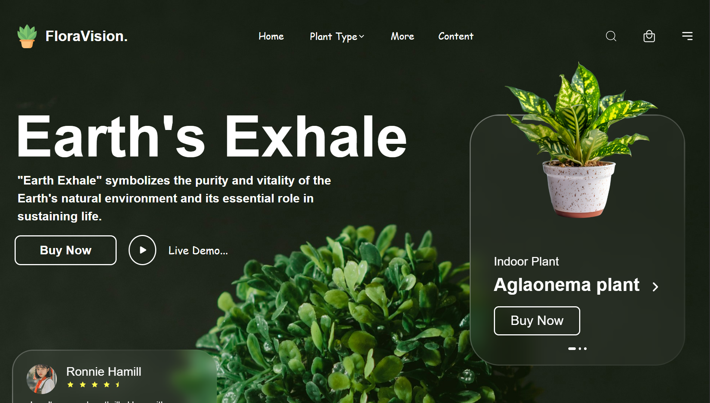
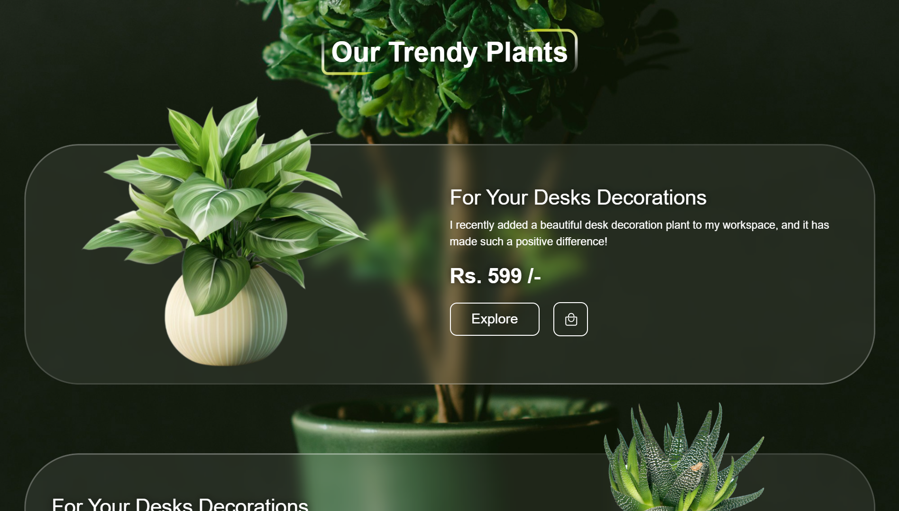
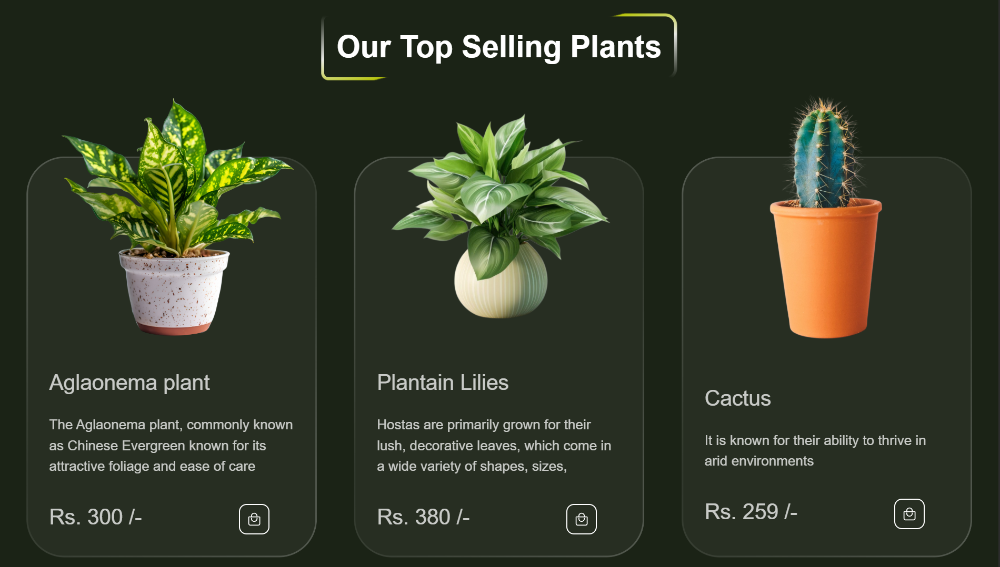
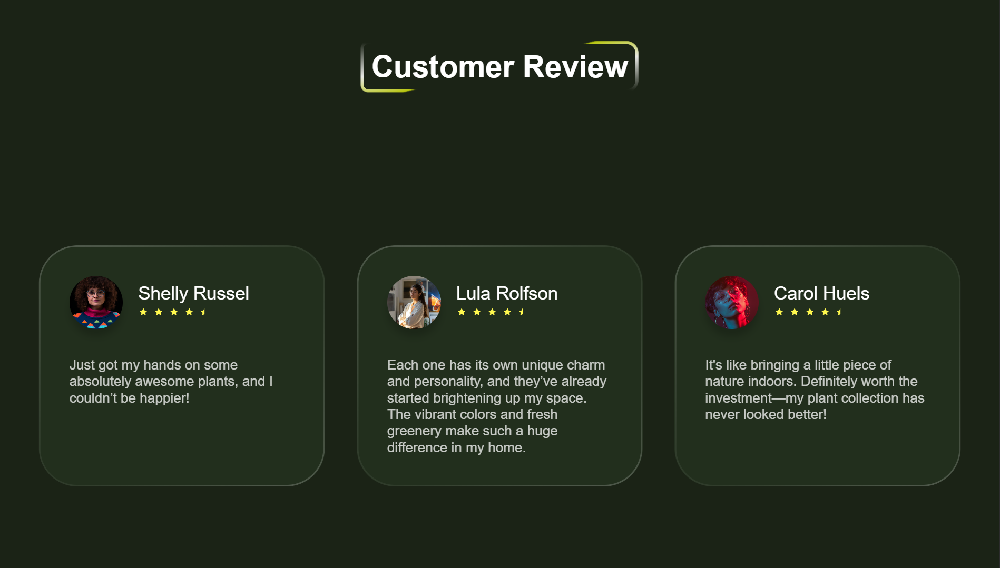
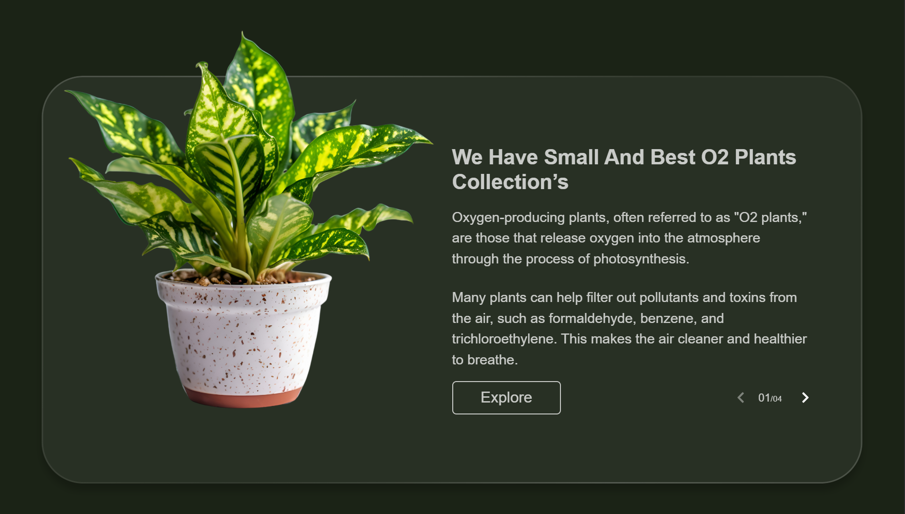
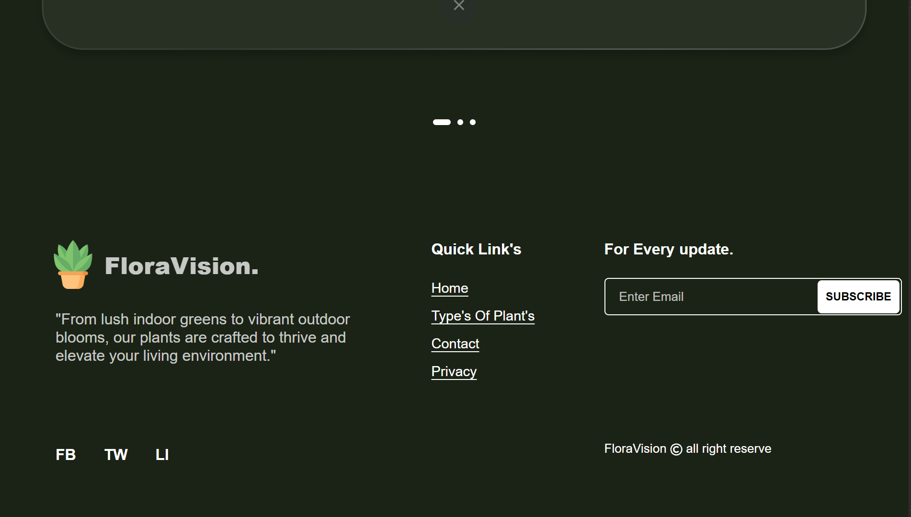

# 🌿 SoftDef Frontend Developer Internship Test

## 🧩 Overview
This project was developed as part of the **Frontend Developer Internship Test** for **SoftDef**.  
It replicates the provided **Figma design** precisely — ensuring a pixel-perfect, responsive, and functional user interface across all devices.  

The main focus areas include reusable React components, Tailwind CSS styling, and attention to detail in layout, typography, and responsiveness.

---

## 🚀 Live Demo
👉 [View Deployed App](https://softdef-assignment-alpha.vercel.app/)

---

## 🎨 Figma Design
[Click here to view the official Figma design](https://www.figma.com/design/U0mtBXWgFim69YDj4pjY8f/Front-end-test?node-id=0-1&t=oH11OPBWgwE38lvp-1)

---

## 🖼️ Screenshots







---

## ⚙️ Technologies Used
- **React.js** – Component-based frontend library  
- **Tailwind CSS** – For modern, responsive styling  
- **JavaScript (ES6+)** – Logic and interactivity  
- **Vite** – Fast and optimized build tool  
- **Git & GitHub** – Version control and collaboration  
- **Vercel** – Deployment platform  

---

## 🧠 Setup & Run Instructions

### 1️⃣ Clone the repository
```bash
git clone https://github.com/mohanreddytm/softdef-assignment.git
